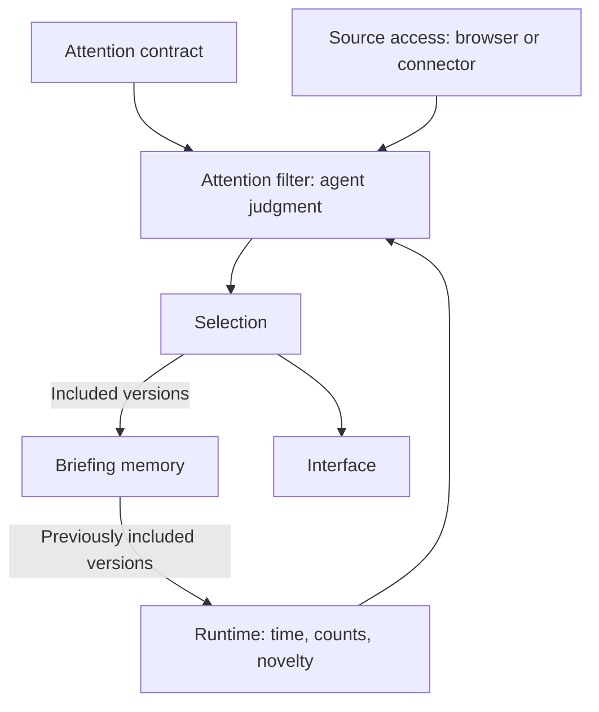

# Architecture

The **attention filter** decides which observed content deserves the user's attention. It is the agent's judgment, guided by the **attention contract** and supported by three things: **source access**, the **runtime**, and **briefing memory**. The filter produces one selection, which supplies both the output and the memory of what was shown.

| Component | Responsibility |
|---|---|
| Attention contract | What matters: interests, sources, exclusions, source procedures, limits and presentation |
| Source access | How the agent reaches a source: an isolated browser or an explicitly connected tool |
| Runtime | Time, inspection counts, stopping evidence, novelty comparison, validation, rendering, saving |
| Briefing memory | Which item versions were already brought to attention |

## The division of labour

The design rests on one split. The agent does what needs judgment: reading a page, interpreting a source, deciding relevance, writing the entry. Code does what a model does unreliably, and what must not depend on its self-report:

- **Time.** A model cannot measure elapsed time. The runtime holds the clock and reports when to stop.
- **Counting.** The agent submits the identities it inspected; the runtime unions them across batches and counts distinct items. A manually supplied total is rejected.
- **Novelty.** The runtime fingerprints the exact observed text and compares it with every saved version. Changed text alone is uncertain, even with the same method label. Private conversations can qualify with new incoming-event evidence; known public posts stay withheld until edit verification is supported. The agent never handles hashes.
- **Stopping.** A surface is "checked" only with a supported reason. Exhaustion needs evidence, a loading frame proves nothing, and a ceiling overrun is reported as an overrun.
- **Integrity.** The final selection is rebuilt from captured references, so an entry cannot cite an item that was never inspected, was already briefed or belongs to another account. Memory artifacts are digest-checked between preparation and saving.
- **Escaping.** Source text is data in every interface and can never become markup.

The limit of this split is stated wherever it matters: helpers validate what the agent submits, but they cannot intercept a tool call, prove an observation true, or enforce that a browser only reads. Those remain instructions, backed by the host's own controls.

## Attention contract

The user owns the contract. It defines the sources to inspect, what makes an item relevant, what to exclude, how much work a run may do, where memory is stored and how the result is presented. `setup` creates it and `tune` revises it through focused changes. An explicit request to apply a precise lasting change is authorization; proposal-only requests and unresolved choices wait for the user. Earlier revisions are kept. Preferences change only this way, never by inference from what the user clicked or ignored. The shared contract helper prepares a validated patch against a known base and applies it with a stale-base check, revision archive, changelog entry and proposal cleanup. Setup starts from the bundled template; tuning never rewrites the whole contract through the model.

Every coverage thread has an opaque service key, its surfaces, an `access` object, selection rules and a `procedure` describing navigation or retrieval, account identity, read-state effects, item identity and pagination. No code or skill dispatches on a service name, so a new source is a contract edit and needs no change to the plugin. See the [contract guide](contract-guide.md).

## Source access

Each thread selects `access.type`. Browser access names a provider and requires a task-owned tab in an isolated environment with its own sign-in. Connector access binds an exact tool namespace and optional connection reference. An unavailable route makes its surfaces unavailable; nothing falls back. These are agent-operated procedures, not bundled drivers or API clients: the schema validates the choice, while tool availability, account identity and action effects are established at run time. The [run skill](../skills/attention-diet/SKILL.md) holds the shared rules and each provider has one guide under [integrations](../integrations/README.md).

## Runtime

`runtime.py` is the whole run: `plan`, `start`, `capture` (or `window` and `capture-window`), `finalize`, `finish`.

- `plan` validates the contract once and returns it with its digest, the resolved routes, and only the guides that contract selects. It creates no state.
- `start` opens one private workspace and the clock, reserving time for finalization. It refuses a contract that changed since the plan.
- `capture` takes a batch of observations. It starts that source's clock, fingerprints candidates, compares them with history, counts distinct inspected items and assesses coverage against the actual clock. A `window` bounds a browser batch before it is read: a single-use ticket carries the remaining allowance, the identities already seen and a deadline, and optional `browser_extract.js` stops before reading a card beyond it. A batch can span pages without renewing that allowance. Capture keeps all inspected identities, fingerprints only eligible candidates, and can return the next ticket/limit/deadline without repeating scope or seen IDs. Identified unreadable cards preserve partial coverage without blocking later cards.
- `finalize` closes collection, infers account/thread/surface and entry IDs from captured references (and section when unambiguous), validates the selection, renders the configured interface and saves local memory, once.
- `finish` stops the clock, adds any storage notice, delivers the output and removes the workspace.

`run_budget.py`, `surface_coverage.py`, `briefing.py`, `briefing_memory.py` and `contract.py` are the parts `runtime.py` is built from, usable alone for diagnostics. They share one process and one set of modules.

### Parallel collection

Reading two sources is independent work, and the run state is already the place where observations accumulate. Parallel collection therefore adds no protocol: when the contract permits it and the host can start subagents, the run starts with `--parallel` and one collector per source service calls the same `window` and `capture` commands against the same run. Three properties of the run state make that safe. Every transaction holds a file lock and a busy lock is waited for, so simultaneous captures cannot lose an update. Each source has its own outstanding window and its own clock, the clocks run side by side under the single overall deadline, and one source reaching its ceiling stops only its own collector. At sealing, a collector that finished early is charged up to its last capture rather than up to the slowest one.

Collectors only observe. They return draft entries that cite captured references, and the main agent merges them, applies the output ceilings and the single surprise allowance, and finalizes once, where every reference is checked as in a sequential run. An interrupted collector needs no recovery: its captures are in the run, and its unfinished surfaces appear as stopped early or not checked. What the helpers cannot establish is whether the host truly runs collectors and their browser tabs concurrently; where it does not, the run is correct and merely no faster.

Only for Supermemory on Codex, [`codex_adapter.js`](../integrations/codex-adapter.md) runs inside the host's code mode with injected tools. It imports Supermemory originals once, forwards prepared artifacts unchanged and records upload attempts before writing, so failed commands or truncated output can never become saved content. It is not a separate authenticated client. Local-memory runs call the runtime directly without loading JavaScript. Other hosts use the manual Supermemory guide when selected; no run needs both memory guides.

## Selection and presentation

`attention-selection/1.1` is the boundary between collection and output. It holds the contract revision, run identity, coverage for every configured surface including unchecked ones, the selected entries, their source links and the item versions they represent. Validation checks scope, output ceilings, duplicate versions and account consistency. A source link may be null; the entry then keeps its source attribution.

Every interface renders this record, so changing the view never collects again, changes what was selected or writes memory. The built-in views are Markdown, a dense HTML list and an HTML card grid. A template beside the contract can replace them, and a template that takes the selection as `$data` can build any view from it; such a template must stay offline through a Content-Security-Policy, which the renderer enforces. Every view keeps the completeness line and the notices. HTML output is a local file: nothing is hosted, delivered or scheduled.

## Briefing memory

The finalized selection yields one record per service account, holding exactly its included item versions, a short summary and a coverage note. Inspected or rejected candidates never enter memory. Public entries without an identified account are shown with a notice and not saved under a guessed identity. A quiet run writes nothing.

Records keep contract ID and revision, account key, predecessor version and item identities. Exact versions are suppressed across the full history. A changed text hash does not prove comparable extraction or a source edit. For private communication, an established incoming-ID method or a later absolute source event can establish novelty; public-post changes remain uncertain. The runtime derives that distinction from the captured thread's content type, not the agent's editorial fields. `previous_ids` carries history through a rename. Local storage uses private files and atomic writes; Supermemory uses agent-operated connector tools with verification of the stored original. See [briefing memory](../integrations/memory/README.md).

Memory is saved immediately before the result is returned. The host cannot couple that write to the display of the response, so a known interrupted delivery needs an explicit correction rather than an invented read state.

## Data boundaries

Three schemas define them: the [attention contract](../schemas/attention-contract.schema.json), the [selection](../schemas/selection.schema.json) and the [memory record](../schemas/memory-record.schema.json). All structural validation goes through these files in `validation.py`; Python adds only the checks between fields, such as configured scope, budgets and account consistency. Tests use fictional services, and arbitrary service keys follow the same paths.

## Bounded observation and truthful accounting

A window authorizes reading; it does not cap the truth reported after accidental excess exposure. Normal oversize `capture-window` payloads fail without state changes. Explicit overrun recovery retains all identities in observation order, creates candidates only within the original allowance, consumes the ticket, and stops that surface. The receipt supports exact retries while collection remains open. Direct capture cannot bypass an outstanding ticket and uses the same candidate exclusion/counting rules. Counters are derived from identities; no additional allowance is granted. Overflow text does not enter candidate or briefing memory.

New selections use `attention-selection/1.2`, retaining legacy status and adding boundary, exhaustion evidence, overrun/within-allowance counts and unreadable-content facts. Readers still accept 1.1 selections; new fields cannot be written under the old version. Existing contracts and saved item fingerprints do not change. Plan capabilities advertise recovery, structured exhaustion, and selection 1.2. Missing structured evidence keeps a new end claim unknown. The runtime validates the evidence shape and matched totals but cannot independently establish the truth of browser observations.
