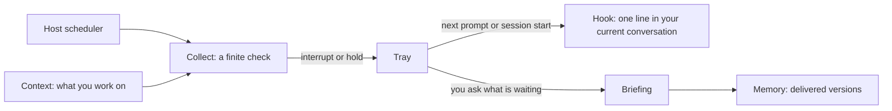

# Proposal: an attention layer

Status: design for review, not implemented. September 27, 2026. Replaces the focus-layer sketch first proposed in this pull request (#3): no separate focus file, and scheduling is designed rather than excluded.

## The claim

Attention Diet so far answers one problem: interfaces built around a feed hold your attention longer than you meant to give it. This proposal adds two more:

1. **Switching mostly earns nothing.** Most of what waits in an inbox or a notification list does not need you now, but reading it fills your head anyway.
2. **So the sources should come to where you work, not you to them.** If you do your work in an agent host (Codex, Claude Code, Cursor), you should not need to leave it to find out whether something needs you. A few times a day the agent checks your sources against your contract. It tells you what needs you at your next natural break, and holds the rest until you ask.

The plugin stays finite and read-only. What changes is when a check runs and how its result reaches you.

## What changes from the focus-layer sketch

| Focus-layer sketch (PR #3) | This proposal |
|---|---|
| A separate `focus.json` with expiring items | Modes written as plain-language rules in the contract; the active mode is runtime state |
| Focus derived from tracker or note signals | Context from what you are working on, read from session metadata and your own statements |
| Scheduled checks out of scope | Scheduled collection by the host; delivery at your next break through hooks |
| Memory unchanged | A tray holds findings until they are delivered; memory records only what was delivered |

## Principles

1. **The contract changes only when you ask.** Switching modes is state, not a preference change, so it creates no contract revision.
2. **Preferences are never inferred from what you consume.** Context about what you are working on may come from what you committed to or said, never from the sources being filtered.
3. **Every run is finite.** Limits, completeness line and read-only rules apply to scheduled runs as to runs you start.
4. **Nothing reaches you in between except by rule.** The active mode says what counts as an interruption, and a daily budget caps how many there are. Everything else waits.
5. **Held is not shown.** Memory records an item only once it has been delivered to you.
6. **The plugin schedules nothing itself.** The host's scheduler starts runs. Scheduled runs use connectors only.

## Three parts: collect, hold, deliver



### Collect

The host's scheduler starts the run skill with a scheduled trigger, for example twice a day on weekdays:

- **Only connector threads run.** Browser threads are skipped with one notice, because nobody is present to sign in and most feed platforms prohibit automated access.
- **The runtime is the same.** `plan`, `start`, `capture` and `finalize` keep their limits, counts, novelty comparison and completeness line.
- **Each selected entry gets a class.** The agent judges it against the active mode: `interrupt`, with the rule it meets, or `hold`. The runtime validates the class and the budget, not the judgment.
- **Finalize writes to the tray, not to memory.** A scheduled run delivers nothing and remembers nothing.
- **Novelty includes the tray.** A candidate already waiting in the tray is not collected again.

### Hold: the tray

The tray is runtime state beside memory (`<memory directory>/tray/`), not a file you edit. It holds the entries of scheduled runs until they are delivered or expire:

- entry title, summary, reason, class and the rule it met, with its captured item reference and fingerprint
- the run it came from and when
- an expiry, set by the mode's `hold_for_days`

It stores what a briefing would show and nothing more: no source bodies, no rejected candidates. Memory keeps its current definition ("which item versions were already brought to the user's attention") and still holds no pending lists. The tray is that pending list, kept separate on purpose.

### Deliver

**At your next break.** A plugin hook runs when a session starts and before each prompt you submit. If the tray has undelivered `interrupt` entries, it adds one short line to the conversation, for example:

> Attention Diet: 1 item needs you: "PX relaunch: sign-off needed by Thursday" (asks you for a decision this week). 6 more are held. Say "what's waiting" to see them.

Each interrupt is announced once. In focus mode only entries that meet the focus rule are announced; the count of held entries is still shown. The line is marked as data from your sources, not instructions, and the hook never passes source text beyond the entry title and reason.

**When you ask.** "What's waiting?" or "what happened that matters now?" renders a briefing from the tray, re-ranked against what you are working on at that moment. Delivered entries move to memory through the existing finalize path and leave the tray.

**Optional.** A desktop notification for `interrupt` entries, within the same daily budget. Codex can also post the line into one chosen thread with a heartbeat automation.

### Modes in the contract

Modes are plain-language if-then rules, installed and revised through `tune` like any other contract change:

```json
"modes": {
  "default": "normal",
  "normal": {
    "rule": "Tell me what needs me at my next break; hold everything else until I ask.",
    "interrupt": "A message that needs a reply or decision from me within two working days.",
    "interrupts_per_day": 3,
    "hold_for_days": 3
  },
  "focus": {
    "rule": "I am working on one thing. Stay quiet unless it cannot wait.",
    "interrupt": "A decision needed from me today, about work I am currently doing.",
    "interrupts_per_day": 1,
    "hold_for_days": 5
  }
},
"execution": {
  "mode": "scheduled_by_host",
  "schedule": { "times": ["08:30", "13:30"], "days": "weekdays" },
  "scheduled_sources": "connectors_only"
}
```

You switch modes by saying so: "focus mode until 3pm", "back to normal". The switch is stored with the tray as runtime state, with an optional end time, and shown in every briefing notice.

## Context: what you are working on

Rules such as "work I am currently doing" need a signal the agent can read at collection time. In order of preference:

1. **A session line.** The plugin's hook appends one line per session to runtime state: host, project folder, branch and session title where the host provides one. Rolling window of two days. No transcript is read.
2. **Codex thread goals.** Codex keeps the objective and status of each thread's goal locally. Active objectives are read, nothing else.
3. **Your own statement.** "I am on the relaunch until Friday" is stored with the mode state and expires.
4. **Optional connectors,** such as calendar events you accepted today or tracker issues in progress, named in the contract.

The separation rule from the focus-layer sketch stays: no context signal may share a service key or tool namespace with a coverage thread, so an incoming email can never make its own topic important.

## Hosts

Checked against official documentation on September 27, 2026.

| | Codex | Claude Code | Cursor |
|---|---|---|---|
| Scheduler for collection | Automation (`cron`), runs locally in a project | Desktop scheduled task, local, down to one minute | Headless CLI (`agent -p`) with launchd or cron |
| Local contract, memory, tray | Yes | Yes | Yes |
| Connectors | Yes | claude.ai connectors and local MCP servers | MCP servers from `mcp.json` |
| Hooks for delivery | Plugin hooks (`session_start`, `stop`); whether they can add context is not yet verified | `SessionStart`, `UserPromptSubmit` with added context | `sessionStart` with added context; `beforeSubmitPrompt` exists, adding context not yet verified |
| Into one chosen thread | Heartbeat automation | No | No |
| Requirement | App running | App running, computer awake; one catch-up run after sleep | Computer awake |

Not in the first version:

- **Cloud schedulers.** Claude Code routines and Cursor Automations run without your local files. The contract, tray and memory would have to live in a repository or an online store, and Cursor delivers only to pull requests and Slack, which means leaving your workspace.
- **Browser sources in scheduled runs.** They need you present to sign in, and most feed platforms prohibit automated access.

Where a host cannot add context before a prompt, the notice arrives at the next session start instead, and the desktop notification covers anything that meets the interrupt rule.

## What stays the same

- The contract changes only when you ask, and clicks never change anything.
- Runs are finite, read-only and end with a completeness line. A run can find nothing.
- You can still start a check yourself at any time; it delivers directly, as today.
- Sources, scope and limits change only through `tune`.

## Risks

- **Injection through the hook line.** Tray entries are derived from source content. The line carries only a title and reason written by the agent, is labelled as data, and has a fixed length.
- **Unattended tool use.** Scheduled runs need read tools pre-approved. Setup lists the exact tools and warns about connectors that also offer writes; `account_actions: none` still applies.
- **Missed runs.** A sleeping computer skips runs. Tray expiry keeps held items from going stale, and the next run's completeness line says what was covered.
- **Two hosts, one tray.** Tray writes use the runtime's file lock, and an entry is delivered once, wherever it is announced.
- **Cost.** Two runs a day per contract. The contract's limits bound each run.

## What changes

| Part | Change |
|---|---|
| Contract schema | Optional `modes`; `execution.mode: scheduled_by_host` with `schedule` and `scheduled_sources` (1.3 → 1.4) |
| New schema | `attention-tray/1.0` for tray entries and mode state |
| `runtime.py` | `--trigger scheduled`; connector-only plan; entry `class`; finalize to tray; tray-aware novelty |
| `scripts/tray.py` (new) | `list`, `notice` (for hooks), `deliver`, `expire`, `mode set/show`, `context add` |
| Hooks | One hook per host: session line, and the notice line when the tray has undelivered interrupts |
| Skills | Run skill: scheduled branch and "what's waiting". Tune: modes and schedule. Setup: creating the host's scheduled task |
| Evals | Budget respected; focus mode holds; browser threads skipped when scheduled; held items not remembered; hook line treated as data; context never from a filtered source |
| Docs | README lead framing, contract guide, architecture, data handling, one guide per host |

## Decisions needed

1. Mode state with the tray (as proposed), or a field in the contract that `tune` flips?
2. Default `hold_for_days`, and whether expired entries are dropped silently or listed once.
3. Context for the first version: session line and your own statement, plus Codex goals where available?
4. First hosts: Codex and Claude Code desktop, with Cursor through the CLI?
5. Desktop notifications for interrupts: in the first version or later?
6. Name in the article and README: "attention layer", or keep "Attention Diet" for both?
