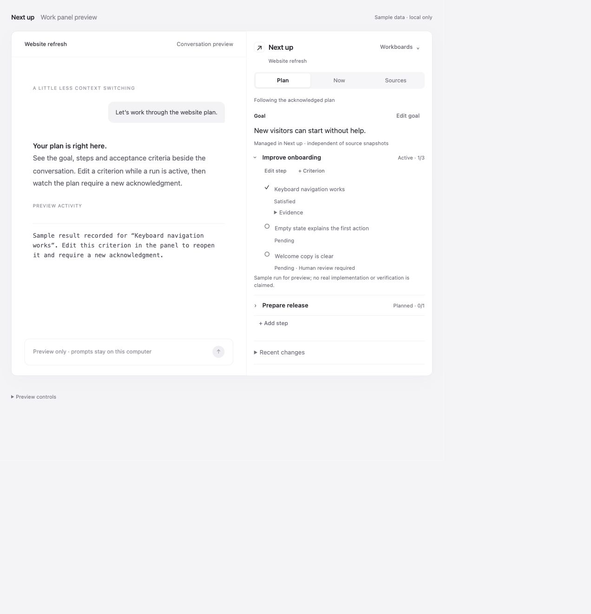

# Validation · 0.4.1 · 2026-10-03

## Current release

The shared-plan prototype has 19 automated tests using the real HTTP and stdio MCP servers and the official client. They cover:

- Tool discovery, HTML resources, input limits, independent calls, host/origin restrictions and preview-route isolation.
- Markdown hierarchy, explicit IDs and revision-scoped anonymous IDs; issue relationships, links and partial sources.
- Durable workboards, pin reconciliation, stale writes and duplicate/uncertain prompt delivery.
- Shared-plan creation and editing through HTTP MCP, completion gates, atomic rollback, duplicate IDs and event pagination.
- Stale-result retention without completing revised criteria, required run acknowledgment, idempotent retry, human-review restriction and controlling-run coordination.
- Restart persistence, board isolation and edits concurrent with unrelated activity reports.

Browser verification used the actual production panel inside the official MCP Apps AppBridge preview. Prompts were captured locally. Source browsing, imports, hierarchy disclosure, pinning, filtering and prompt delivery were checked. Plan/Now/Sources navigation, light/dark themes and 320px/400px widths were inspected.

A synthetic criterion result was recorded through the real MCP tools. Editing that satisfied criterion changed its count from 1/3 to 0/3 and displayed pending acknowledgment. An editor also stayed open during an unrelated progress update and saved successfully without losing the result or the edited text. Historical evidence remained available. These sample results do not claim real website verification.

## Historical host evidence

Earlier inline-card builds were manually tested in a private ChatGPT connection: rendering, explicit prompt delivery and the resulting conversation response worked. The v0.2 connection also discovered panel tools. Private host screenshots and account setup details are not distributed in this package. Those earlier checks do not prove v0.4.1 native Codex panel placement or real-run orchestration.

## Still requiring a live test

- Native panel placement and model tool use in the intended Codex/ChatGPT client.
- Skill selection and adherence during a real task, including a human edit while the agent works.
- Actual Linear/GitHub connector-fed issue imports and host widget-state restoration.

Live Markdown binding/write-back, direct provider synchronization, authenticated human approval and process interruption are not implemented. Evidence is an agent-reported assertion, not independently certified by the store. Deployment remains private and single-user; random board/run IDs are not authentication boundaries.

See the [upgrade and real-plugin test guide](../README.md#update-an-existing-installation). Updating the package alone does not rebuild or restart an existing MCP server.
